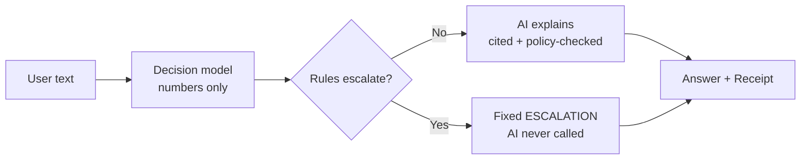
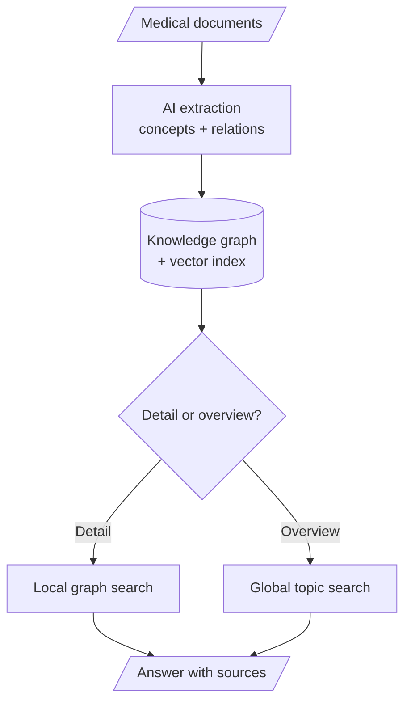

# Medical Decision-Support Harness: Project Report

**This project** is a safety-first medical decision-support harness — one part of a wider system, covered here on its own. A user describes a health concern in plain language and gets (1) a triage level from routine to emergency, (2) red-flag detection over 8 danger signs, and — only when safe — (3) a plain-language explanation citing real source documents. On danger it escalates first with fixed safety text and never consults generative AI. It never diagnoses, never recommends doses, never stores patient data. Not a medical device, not clinically validated.

It is built as a **harness**: a controlled wrapper around AI models that enforces safety rules structurally, so safe behaviour comes from the design itself rather than from trusting the AI to behave.

## 1. Features

- **Instant triage** — urgency from routine to emergency in one fast model call.
- **Red-flag safety net** — 8 danger signs (chest pain, stroke, breathing trouble, bleeding, …); any breach escalates before anything else happens.
- **Cited explanations** — every factual claim points to a real library passage; claims without a valid source are rejected, never shown.
- **Refuses the unsafe** — never names a disease or gives doses; self-harm mentions get a fixed, pre-approved crisis message.
- **Role permissions** — each user role's access is enforced inside the system.
- **Transparent receipt** — every answer carries its trace: model used, rules applied, sources cited.
- **Offline-safe** — if AI or library is down, triage and escalation still work, honestly flagged as degraded.

## 2. How it differs from ChatGPT

| | This system | Generic chatbot (e.g. ChatGPT) |
|---|---|---|
| Core job | Triage + escalation first, explanation second | General conversation |
| Danger handling | Fixed rules; fixed "get help now" text; AI never involved | Generates advice text; can be delayed, diluted, or jailbroken |
| Red flags | 8 danger signs watched; any breach → escalate (100% recall gate) | No guaranteed detection |
| Sources | Every claim cites a real library passage; bad citation = failure | Can invent plausible-but-fake citations |
| Unsafe requests | Refuses diagnosis/dosing with stated reasons | Answers with a disclaimer; can comply |
| Determinism | Same input → identical decision + receipt | Varies run to run |
| Privacy / roles | No records stored; role-based access enforced | Conversations stored; single role |

## 3. What we have done 

Built as a  project, with work split across the decision layer, the knowledge library, the safety rules, and the service assembly:

- **Decision layer** — a fast local model scores urgency, red flags, and safety guards in one call; recorded fixtures keep all tests offline and deterministic.
- **Rule engine (the safety core)** — AI-free escalation logic: five escalation conditions, versioned thresholds, tested on both sides of every boundary.
- **Knowledge library** — an offline indexer turns medical documents into a knowledge graph with vector search and topic summaries; retrieval returns citable passages only, never AI-generated text.
- **Explanation layer** — an AI writer that may use tools but is policy-gated: citations required, unsafe output blocked, refusals reason-coded.
- **Assembly** — one pipeline (decide → escalate → explain) exposed as a web service with a verifiable receipt per answer; 75 automated tests green, plus an offline demo.

## 4. Models and technology

| Layer | Choice | Role |
|---|---|---|
| Decision | Laya 421M, hosted locally | Urgency + flags as numbers, never prose |
| Explanation | Qwen 32B (hosted) | Cited answers, tool use, refusals |
| Embeddings | MiniLM, 384-dimension | Semantic search vectors |
| Vector store | Qdrant (3 collections) | Passages, concepts, topic summaries |
| Graph store | Neo4j | Concepts, relations, provenance |
| Stack | Python, FastAPI, Docker | Service, offline indexing, validation |

## 5. Extensibility — more tools make it better

The harness improves by adding tools, without touching the safety core: lab-range lookup, drug-interaction checker, symptom questionnaire, emergency-contact directory — and more can follow (dosage calculators, guideline publishers, local-clinic finders). Each new tool gives the AI more verified facts to cite, so answers get richer while the same gates keep them safe. Natural next steps: multilingual support, voice input, a clinician review dashboard over the receipts.

## 6. Summary

This system succeeds by structure, not cleverness: **the model decides, the rules escalate, the AI explains, and the tools hold the truth.** Safety is proven twice (a structural check plus a test that the AI is never touched on the emergency path), and evaluation reports bad numbers honestly — the off-the-shelf decision model has no medical training, so modest baseline accuracy is expected and fine-tuning is the planned next step. Current state: safety core, knowledge library, and service working; full-corpus indexing and the final baseline report remain.
