# Full Architecture — The Complete Spec (Indexing + Query)

The consolidated, stage-by-stage architecture of this GraphRAG system: what
happens at **index time** (stages I1–I11, expensive, paid once, checkpointed)
and at **query time** (stages Q0–Q6 / QG, cheap, per question), with the data
model, the on-disk contracts, the cost model, and the failure modes.

This document synthesizes the whole doc set into one spec. Companion reading:

| Doc | What it adds |
|---|---|
| [architecture.md](architecture.md) | The same system as pure theory, readable without code |
| [graph_making.md](graph_making.md) | Build-pipeline mechanics with real examples |
| [solution.md](solution.md) | The entity-merging story and its three live failures |
| [embed_research.md](embed_research.md) | Geometry vs. topology; the embedding layer |
| [NER_model.md](NER_model.md) | Encoder-based extraction as an alternative writer |
| [system-1-model.md](system-1-model.md) | Fast calibrated decisions as an overlay |

**The idea in one line:** ordinary RAG stores *what the text says*; GraphRAG
additionally stores *how the facts connect* — and the architecture makes sure
that structure is cheap to build once, cheap to search forever, and citable
back to the raw text at every step.

---

## Contents

| Part | Topic |
|---|---|
| 0 | The system at a glance |
| 1 | The data model |
| A | **Indexing phase** — I1…I11 in detail |
| A.9 | Artifact chain and the cost model |
| B | **Query phase** — Q0…Q6 and QG in detail |
| C | Failure modes and their defences |
| D | Optional overlays (encoder extractor, System One decisions) |
| E | Honest limits |

---

## The one diagram — study this and you know the system

Everything below this section explains and justifies this picture. Read it
top to bottom: the left half is **index time** (paid once), the middle column
is **what lives on disk** (the three stores), and the right half is **query
time** (paid per question). Dashed arrows are fallbacks. Every box marked
**(LLM)** is a model call — there are only five kinds in the whole system;
every other box is deterministic code.

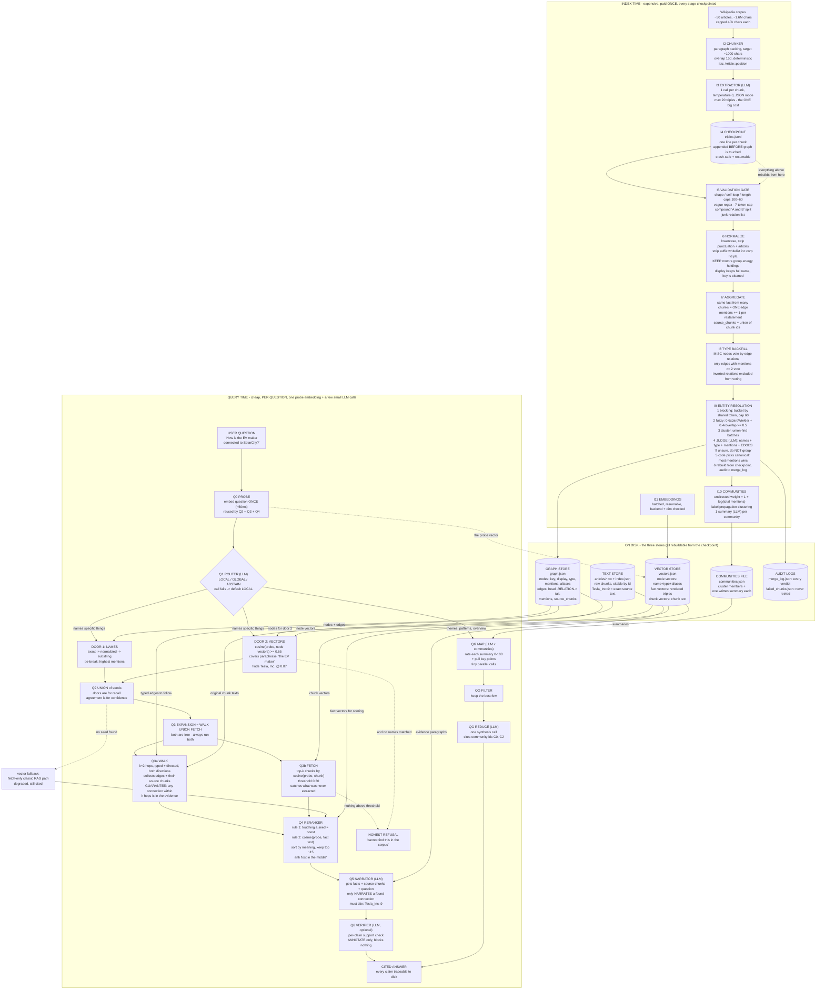

How to read the notation:

| Notation | Meaning |
|---|---|
| solid arrow | the normal flow of data |
| dashed arrow | a fallback, or a "rebuilds from" dependency |
| **(LLM)** | a model call — extraction, judge, summaries, router, narrator, verifier, map, reduce |
| no mark | deterministic code — free, instant, reproducible |
| `( ... )` cylinder shape | a file on disk |
| numbers on boxes | the actual thresholds and parameters the system uses |

---

## Walkthrough — every part of the diagram, with an example

Each region of the diagram, what it does, and a real example from this
corpus. If a part ever feels abstract, come back here.

### 1. Index left edge: corpus → chunker → extractor → checkpoint

**What happens.** Articles are fetched and truncated (I1), cut into
deterministic ~1,000-char chunks with 150 chars of overlap (I2), and each
chunk is read by one LLM call that returns entities and triples (I3). The
result is appended to `triples.jsonl` *before* anything else happens (I4).

**Example.** Chunk `Tesla_Inc::1` contains *"Musk oversaw … Series B venture
capital funding round of $13 million in February 2005"*. The extractor
returns:

```json
{"chunk_id": "Tesla_Inc::1", "doc": "Tesla, Inc.",
 "triples": [{"head": "Elon Musk", "relation": "CEO_OF", "tail": "Tesla, Inc."}],
 "entities": [{"name": "Elon Musk", "type": "PERSON"}]}
```

**Why it matters.** Extraction is the only expensive step (~1,200 calls).
The checkpoint makes it survivable: kill the process at minute 80, restart,
and finished chunks are skipped. Delete the graph and it rebuilds from this
file in seconds, free.

### 2. The cleaning chain: gate → normalize → aggregate → backfill

**Gate (I5).** A funnel of free rejections. Example rejections:
`COMPETES_WITH → "other automakers"` (vague — names no identifiable thing);
a 12-token rambling name like *"tesla inc series b venture round of 13
million in february 2005"* (length cap); `"Martin Eberhard and Marc
Tarpenning"` as one name (compound — split into one fact per person). What it
cannot catch: inverted triples, which are grammatically valid.

**Normalize (I6).** `"Tesla, Inc."`, `"Tesla Inc"` and `"tesla, INC."` all
become the key `tesla` — while the display keeps "Tesla, Inc.". The suffix
whitelist strips `inc/corp/ltd/plc` but *keeps* `motors/group/energy`,
because "General Motors" is not "General".

**Aggregate (I7).** Five chunks stating `Elon Musk --CEO_OF--> Tesla` do not
become five edges. They become **one edge with `mentions: 5`** and the five
chunk ids. That count is free confidence: real facts are restated; junk
appears once.

**Type backfill (I8).** A node typed `MISC` gets a type by voting over its
edge relations — but only edges with `mentions >= 2` vote. (One live run
typed "Tesla Motors" as PERSON because a single inverted `FOUNDED_BY` edge
voted; that is why the threshold exists.)

### 3. Entity resolution (I9) — the merge funnel

**What happens.** Blocking buckets names by shared token (so 2,000 names
cost hundreds of comparisons, not millions); fuzzy scoring ≥ 0.5
*nominates* pairs; union-find chains nominations into small batches; one
LLM call per batch judges them **with graph evidence**; code picks the
canonical name; the graph is rebuilt from the checkpoint; everything is
logged.

**Example — the 0.73 paradox (why the LLM exists):**

| Pair | Fuzzy score | Truth | A threshold cannot win |
|---|---|---|---|
| `tesla` vs `tesla motors` | 0.73 | **merge** (former legal name) | any cut merging this row |
| `tesla` vs `tesla energy` | 0.73 | do not merge (real division) | also merges these two |
| `tesla` vs `tesla powerwall` | 0.72 | do not merge (a product) | — |

The judge is shown *behavioural profiles*, not strings: "Tesla, Inc. —
ORGANIZATION, 76 mentions — edges: `CEO_OF` in, `LOCATED_IN` out,
`ACQUIRED → SolarCity`" versus "Tesla Powerwall — edges:
`PARTNER_WITH → Tesla, Inc.`". One is *made by* the other → different
things. Result: company variants merged, all seven products and both
gigafactories correctly refused, every verdict in `merge_log.json`.

### 4. Communities (I10)

**What happens.** The graph collapses to undirected links weighted
`1 + log(total mentions)` (so an 80-mention hub is loud but not deafening),
label propagation finds dense clusters, and each cluster gets **one** LLM
summary — written once at index time.

**Example.** Cluster C0 = {Tesla, Elon Musk, SolarCity, Gigafactory Texas…}
→ summary: *"Tesla, Inc. is a US automaker led by Elon Musk; it acquired
SolarCity in 2016 and competes with other EV makers…"*. Any future
"what are the themes?" question reads a handful of these paragraphs instead
of 1.6M characters.

### 5. The three stores (the middle column)

| Store | Holds | Example row |
|---|---|---|
| **Graph store** (`graph.json`) | structure | node `{key: "tesla", display: "Tesla, Inc.", type: ORGANIZATION, mentions: 81, aliases: [Tesla, Tesla Motors, Inc.]}`; edge `{head: "elon musk", relation: "CEO_OF", tail: "tesla", mentions: 5, source_chunks: [Tesla_Inc::1, ::4, …]}` |
| **Vector store** (`vectors.json`) | meaning-as-geometry | `"Tesla, Inc. — ORGANIZATION — 81 mentions — aliases: …"` → a 768-dim point; `"the EV maker"` lands *nearby* though it shares zero characters |
| **Text store** (`articles/`) | the citable truth | chunk `Tesla_Inc::9` — the exact paragraph that says Tesla acquired SolarCity |

The graph knows *what connects to what* but is blind to *what means what*;
vectors are the opposite; the text store is what every answer is finally
checked against. All three rebuild from the checkpoint.

### 6. Probe + router (Q0–Q1)

**Probe.** The question is embedded **once**; that one vector is reused by
seeding, fetching and ranking. **Router.** One small LLM call classifies the
question's shape:

| Question | Route | Why |
|---|---|---|
| "How is the EV maker connected to SolarCity?" | **LOCAL** | names (or implies) specific things |
| "What are the main themes of this dataset?" | **GLOBAL** | about the whole corpus |
| "Who won the 1930 World Cup?" | **ABSTAIN** | the corpus cannot answer it — say so, don't guess |
| (router call itself fails) | default **LOCAL** | fail toward the cheaper, more precise mode |

### 7. Seeds — two doors, union (Q2)

**Door 1 (names):** exact → normalized → substring matching against graph
nodes; ties broken by mention count. Free and precise, but blind to
paraphrase. **Door 2 (vectors):** cosine(probe, node vectors) ≥ 0.65. Covers
paraphrase, but promiscuous ("Tesla Powerwall" also scores high).

**Example.** Question says *"the EV maker"*: door 1 finds nothing (zero
character overlap), door 2 finds `Tesla, Inc.` at 0.87 → union = {Tesla,
Inc.}. Question says *"Musk"*: door 1 hits `elon musk` by substring, door 2
agrees → agreement is confidence. Question says *"Blorptonic"*: both doors
empty → the fallback path begins.

### 8. Expansion = walk ∪ fetch (Q3)

**Walk.** From each seed, follow typed, directed edges 2 hops in *both*
directions, collecting edges *and* their source chunks. Example walk from
`Tesla, Inc.`:

```
hop 1:  Elon Musk --CEO_OF--> Tesla   (x5, chunks ::1 ::4 ::9)
        Tesla --LOCATED_IN--> United States   (x5)
        Tesla --ACQUIRED--> SolarCity         (x2)
hop 2:  SolarCity --ACQUIRED_BY--> Tesla, Rival --COMPETES_WITH--> Tesla, …
```

**The guarantee no vector search can make:** if a connection exists within k
hops, it is *in the evidence*. **Fetch.** Independently, top-k chunks by
cosine(probe, chunk) ≥ 0.30 — this catches answers living in a paragraph the
graph never extracted. Both are free, so both always run; the union is
ranked together. No seed at all → fetch alone becomes the retrieval
(classic RAG, degraded but still cited).

### 9. Reranker (Q4)

The walk grabs hundreds of facts; most are noise, and a model reading 100
facts may miss the right one buried at position 47 ("lost in the middle").
The reranker scores every candidate — seed-touching gets a structural boost,
then `cosine(probe, fact text)` sorts by actual meaning — and keeps the top
~15:

| Candidate fact | touches seed? | cosine to "Who is the CEO of Tesla?" | Fate |
|---|---|---|---|
| `Elon Musk --CEO_OF--> Tesla` | yes | **0.91** | prompt position 1 |
| `Eberhard --FOUNDED_BY--> Tesla` | yes | 0.74 | kept |
| `Tesla --LOCATED_IN--> US` | yes | 0.31 | dropped — popular ≠ relevant |
| `Tesla --COMPETES_WITH--> BYD` | no | 0.28 | dropped |

The walk decided *what exists* in the evidence; the reranker decides *what's
worth reading*.

### 10. Narrator + verifier (Q5–Q6)

The narrator gets a pre-digested bundle (top facts + their source chunks +
the question) and only has to *narrate a connection that was already found*:

> A: Elon Musk is connected to SolarCity through Tesla's acquisition of
> SolarCity in 2016… `[Tesla_Inc::9]` `[Tesla_Inc::15]`

Citations let a human verify in seconds. The verifier (optional) re-checks
each claim against its cited chunk and **annotates** weakly-supported claims
— it blocks nothing until it has been measured on planted errors.

### 11. Global search — map → filter → reduce (QG)

For overview questions the map step rates **each community summary** 0–100
for relevance and pulls out key points (one tiny parallel call each); the
filter keeps the best few; one reduce call synthesizes them:

```
"What are the main themes?"
map:   C0 → 92 (EV industry, Tesla, Musk)   C1 → 12 (trade war)   C2 → 71 (chips policy)
filter: keep C0, C2
reduce: "Three themes dominate: the rise of EV manufacturing [C0], …"
```

Cheap because the pool is ~dozens of pre-written summaries, never the raw
corpus.

### 12. The fallback arrows (dashed) — why nothing ends in silence

| What goes wrong | The dashed arrow that saves it |
|---|---|
| Router call fails | default to LOCAL |
| Door 1 finds nothing (paraphrase) | door 2 (vectors) |
| Both doors find nothing | fetch-only vector fallback — still cited |
| Even fetch finds nothing above threshold | **honest refusal**: "cannot find this in the corpus" |
| Extraction interrupted mid-run | restart; the checkpoint resumes |

### 13. Every number in the diagram, in one table

| Parameter | Value | Where |
|---|---|---|
| chunk target / overlap | ~1,000 / 150 chars | I2 |
| triples cap per chunk | 20 | I3 |
| length caps / token cap | 100 / 60 chars, 7 tokens | I5 |
| fuzzy nomination threshold | 0.5 | I9 |
| blocking bucket cap | 60 names | I9 |
| judge temperature | 0, JSON mode | I9 |
| community weight | 1 + log(total mentions) | I10 |
| vector seed threshold | 0.65 | Q2 |
| walk depth | k = 2 hops, both directions | Q3 |
| chunk fetch threshold | 0.30 | Q3 |
| evidence kept for the prompt | top ~15 | Q4 |

---

## Part 0 — The system at a glance

The whole machine has two halves with opposite economics:

- **Index time** — read the corpus once, extract its facts, clean the names,
  group the graph into topics, embed everything, save it all to disk.
  Expensive, paid **once**, checkpointed at every expensive step.
- **Query time** — answer a question using those saved structures. Cheap,
  paid **per question**, no new extraction ever.

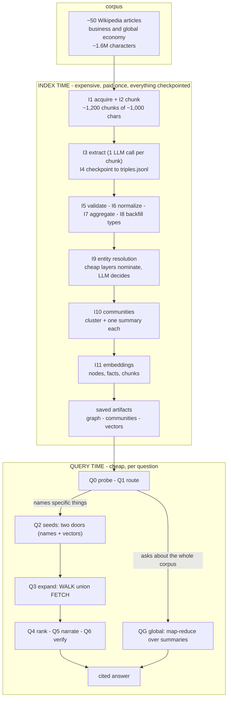

### Where the intelligence lives

The system calls an LLM in exactly **five** kinds of places; everything else
is deterministic code — same input, same output, free, forever.

| Job | Half | Calls | Expensive? |
|---|---|---|---|
| Read a chunk, list its entities and relations | index | 1 per chunk (~1,200) | **yes — the one big cost** |
| Judge whether names mean the same thing | index | 1 per nomination cluster | small |
| Write one summary per community | index | 1 per community | small |
| Read the question, pick a route / extract names | query | 1–2 | tiny |
| Narrate the found evidence into a cited answer | query | 1 | tiny |

**The cost principle:** the only expensive call is paid *once* at index time
and written to a checkpoint — so per-question work stays small, and improving
any later stage costs no new extraction at all.

---

## Part 1 — The data model

Underneath all the vocabulary, the graph is two lookup tables.

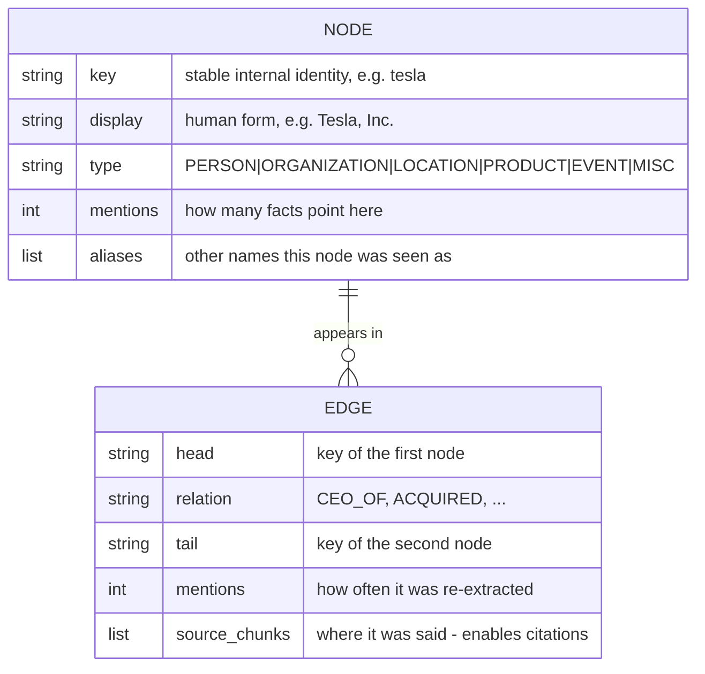

Two load-bearing design points:

1. **The key/display split.** Merging happens on the cleaned key (`tesla`)
   while display keeps the full human name (`Tesla, Inc.`). Without the
   split, every normalization rule would visibly mangle names.
2. **`mentions` is free confidence.** Real relationships get re-extracted
   across articles and accumulate counts; hallucinations and inverted one-offs
   appear once. Mention counts power ranking, pruning, type voting and merge
   evidence — all for free.

A node with its edges is a **hub**; a node with few edges is a **leaf**.
Paths — following edges node to node — are the whole point: a question like
*"How is Elon Musk connected to SolarCity?"* has no answer in any single
chunk, but the graph holds the path
`Elon Musk → CEO_OF → Tesla → ACQUIRED → SolarCity`.

---

# Part A — The indexing phase (I1–I11)

## A.1 — I1 Acquisition

Fetch each article's **plain-text extract** from the Wikipedia API
(`action=query&prop=extracts&explaintext=1`, no key needed), clean section
decorations and excess newlines, and cap articles at **40,000 characters**.

- The article list is curated for *relationship richness* — companies, CEOs,
  deals, regulators, countries — because a graph is only as good as the
  connections inside it.
- Truncation buys **breadth**: 50 related articles produce a cross-connected
  web of topics; one 200k-char article produces 200 chunks of extraction cost
  for a single topic.
- Result: **~50 articles, ~1.6M characters**, one `.txt` per article plus
  `index.json` metadata (title, char count, chunk count, preview).

## A.2 — I2 Chunking

Paragraph-aware greedy packing to `TARGET ≈ 1,000` characters with
`OVERLAP = 150`; oversized paragraphs are split at sentence boundaries.

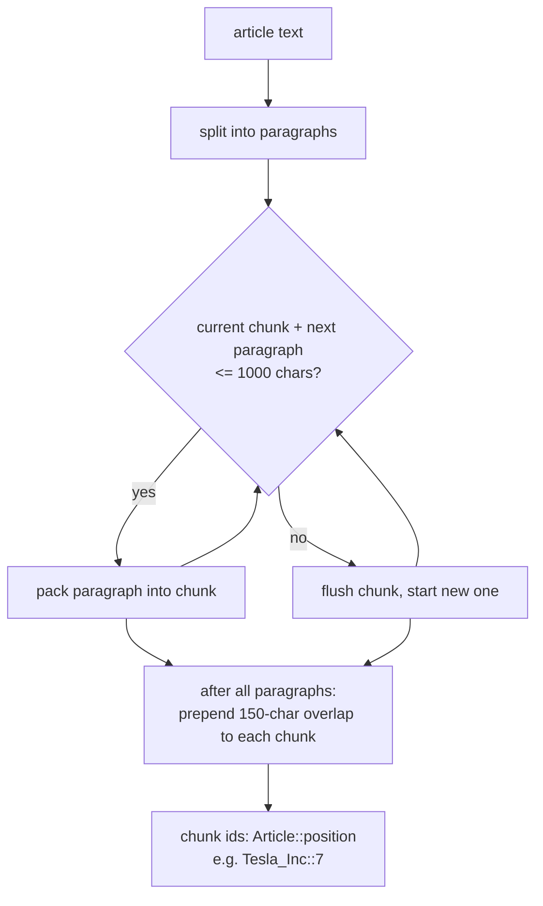

Why cut at all, and why these choices:

- **Attention.** A model asked to list the facts of 1,000 characters is
  precise; over 40,000 it misses things.
- **Granularity of provenance.** Per-chunk extraction gives every fact a home
  address (`Article::position`) — that address *is* the citation.
- **Overlap** is cheap insurance: a fact sitting on a chunk boundary is seen
  by both chunks.
- **Determinism** is the deep requirement: re-running the chunker must
  reproduce the exact same chunks, or every stored citation would rot.

Scale: ~50 articles → **~1,200 chunks** (the extraction workload).

## A.3 — I3 Extraction

**One LLM call per chunk**, returning entities and triples jointly:

```
SYSTEM: You are a precise entity and relationship extraction engine.
        You respond with ONLY valid JSON, no commentary.

USER:   Extract entities and relationships from the text below.
        Rules:
        1. Entity names: use the most complete form ("Tesla, Inc.", ...)
        2. Relations: UPPER_SNAKE_CASE (CEO_OF, FOUNDED_BY, LOCATED_IN,
           PARTNER_WITH, ACQUIRED, SUBSIDIARY_OF, COMPETES_WITH, ...)
        3. Extract ONLY facts explicitly stated in the text. Never invent.
        4. Entity types: PERSON, ORGANIZATION, LOCATION, PRODUCT, EVENT, MISC.
        5. Max 20 triples. Skip trivial facts.
        Return exactly: {"entities": [{"name": "...", "type": "..."}],
                         "triples": [{"head": "...", "relation": "...", "tail": "..."}]}
        TEXT: <<<chunk>>>
```

Call settings that matter:

| Setting | Value | Why |
|---|---|---|
| `format` | JSON mode | parseable output guaranteed at the API level |
| `temperature` | 0 | extraction is a *lookup* task — same input, same output |
| `num_ctx` | 4096 | chunk + prompt + JSON overhead must fit |
| `num_predict` | 600 | caps latency and prevents runaway lists |
| cap on triples | 20 | one rich chunk must not flood the graph and skew all later ranking |

The reader-model has **amnesia**: it does not remember the previous chunk,
knows nothing of the corpus, and will name the same company three different
ways in three consecutive chunks. Everything after this stage exists to
survive that amnesia.

Network robustness is layered (the tunnel to a remote model is flaky):

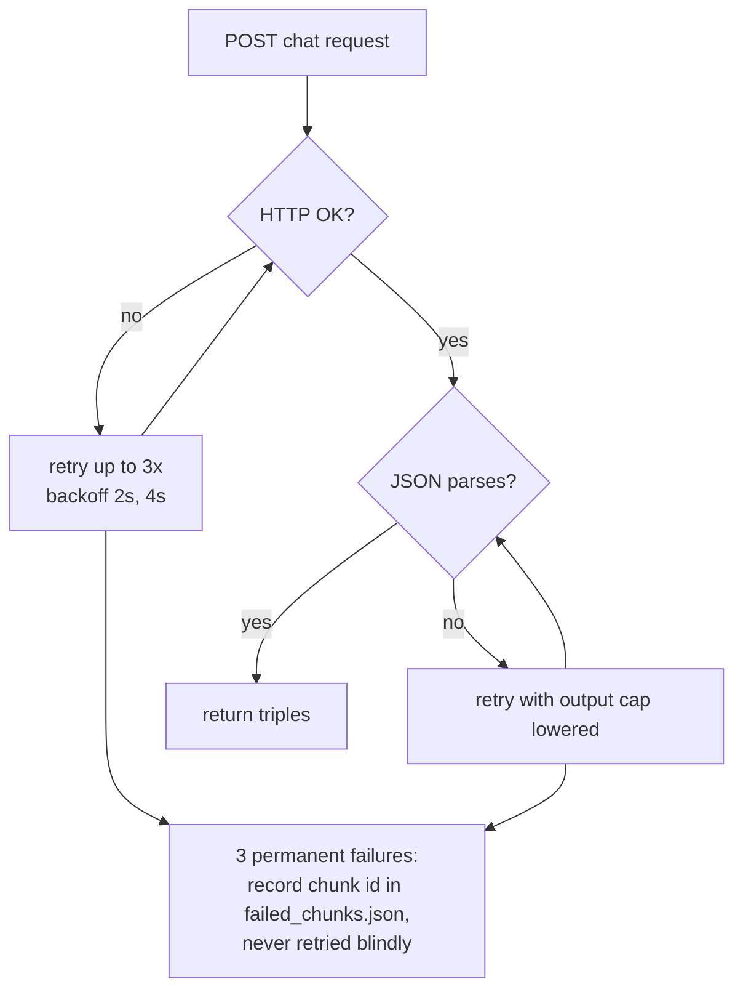

## A.4 — I4 Checkpointing

Every chunk's result is **appended** to `data/triples.jsonl` — one JSON
object per line — **before** the graph is touched:

```json
{"chunk_id": "Tesla_Inc::1", "doc": "Tesla, Inc.",
 "triples": [{"head": "Elon Musk", "relation": "CEO_OF", "tail": "Tesla, Inc."}],
 "entities": [{"name": "Elon Musk", "type": "PERSON"}]}
```

This file is the contract the whole system rests on:

1. **Crash safety** — a full run is ~1,200 LLM calls over hours. Kill the
   process at minute 80, restart, and every already-present chunk is skipped.
2. **Free re-derivation** — the graph, merges, communities and vectors are
   all *derived* from this checkpoint. Fix any later stage and rebuild in
   seconds with **zero LLM calls**.
3. **Auditability** — every triple in the graph traces to the exact chunk,
   and therefore the exact source sentence.

**The checkpoint, not the graph, is the precious artifact** — it is the only
thing in the system that cannot be recomputed for free.

## A.5 — I5 Validation gate

Every proposed fact passes a **funnel of cheap rejections**. Plain rules —
free, instant, identical on every run. A filter, not a fixer.

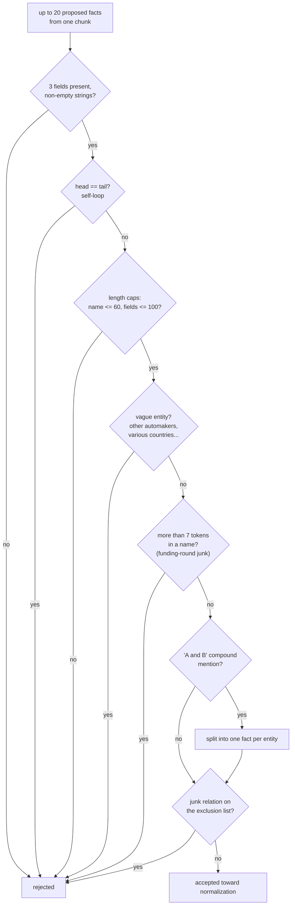

The funnel removes: malformed output, self-contradictions, **vague groups**
that name no identifiable thing, runaway rambling names, and compound
mentions that hide two entities in one name.

What it *cannot* catch: **inverted triples**. "Company X acquired its own
investor" is grammatically fine, so a shape-check passes it. That failure
mode is contained later — by mention-count ranking, by edge evidence for the
merge judge, and by citations in every answer — never by the gate.

## A.6 — I6 Normalization

`normalize_entity()` converts any surface mention into a canonical **merge
key**: NFKD → lowercase → punctuation to space → drop leading articles →
strip trailing corporate suffixes repeatedly.

```
"Tesla, Inc."   → "tesla"        "Tesla Inc"    → "tesla"     (same node)
"BP plc"        → "bp"           "tesla, INC."  → "tesla"
"Elon Musk"     → "elon musk"    (different key → different node)
```

The suffix list is a **conservative whitelist** (`inc, corp, ltd, plc, gmbh,
ag, llc, ...`) and deliberately *keeps* `motors`, `group`, `energy`,
`holdings` — trailing words can carry meaning: "General Motors" is not
"General", and "Volkswagen Group" is a specific thing. `normalize_relation()`
does the same for edge labels (`"is CEO of"` → `CEO_OF`).

This step is free and deterministic and catches a large share of duplicates
immediately — but by design it cannot handle a renamed company or a
surname-only mention. That is I9's job.

## A.7 — I7 Aggregation

The same fact stated by five chunks does **not** become five edges. It becomes
**one edge** with `mentions: 5` and the union of the five `source_chunks`.
Pure dict arithmetic — no model.

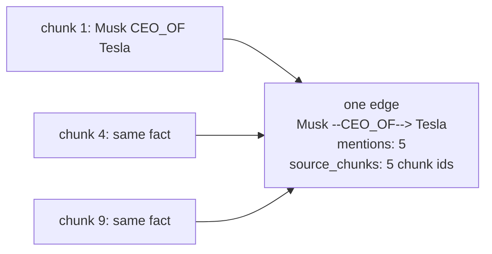

The same rule applies to nodes: a node's `mentions` counts the facts pointing
at it, which is why *Tesla, Inc.* sits in the dozens while most nodes sit at
1–3.

## A.8 — I8 Type backfill

Nodes the extractor typed `MISC` get a type inferred by **voting over edge
relations** — but only over edges with `mentions >= 2` (one-off edges are
noise: in one live run, a single inverted `FOUNDED_BY` edge voted "Tesla
Motors" into a PERSON). Deliberate exclusions keep the known-inverted
relations (`FOUNDED_BY`, `ACQUIRED_BY` as tails; `COMPETES_WITH`,
`PARTNER_WITH` as undirected-ish) from voting.

## A.9 — I9 Entity resolution (the merge funnel)

Extraction produced three nodes for one company — `Tesla, Inc.` (58
mentions), `Tesla` (13), `Tesla Motors, Inc.` (4). This **fragmentation**
causes three failures, the third silent and worst:

1. **Split evidence** — rankings and pruning quietly misjudge importance.
2. **Garbage topics** — clustering produces several "different" companies.
3. **Traversal death** — a walk reaching `tesla` never sees edges stored
   under `tesla inc`. Paths stop with no error, and the missing answer looks
   like "the corpus does not say that".

**Why similarity alone cannot fix it** — the 0.73 paradox: `tesla ↔ tesla
motors` (should merge, former legal name), `tesla ↔ tesla energy` (must not,
a real division) and `tesla ↔ tesla powerwall` (must not, a product) score
0.73, 0.73, 0.72. Identical scores, opposite verdicts. The deciding
information is **world knowledge, not character overlap**.

The funnel: cheap machinery narrows the field, one informed judge decides,
plain code does all the bookkeeping.

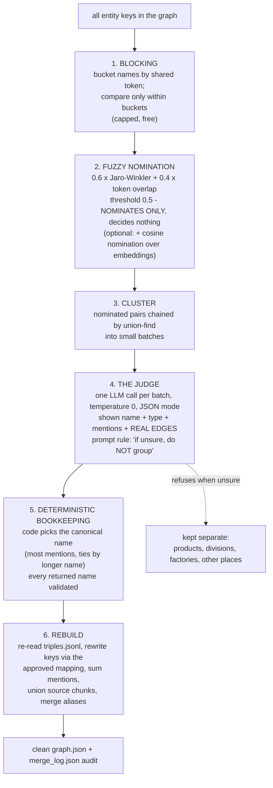

Guardrails set **before** the judge ever sees a pair:

- Pairs containing "and" are skipped — compound artifacts the gate already
  split.
- Pairs joined by an explicit **maker → made** edge (`MANUFACTURES`,
  `LAUNCHED`, `SELLS`...) are skipped as *provably different things*. This one
  rule protects *Tesla Powerwall* from being absorbed into its maker without
  spending an LLM call.

The judge sees **behavioural profiles, not bare strings** — and that is the
whole trick:

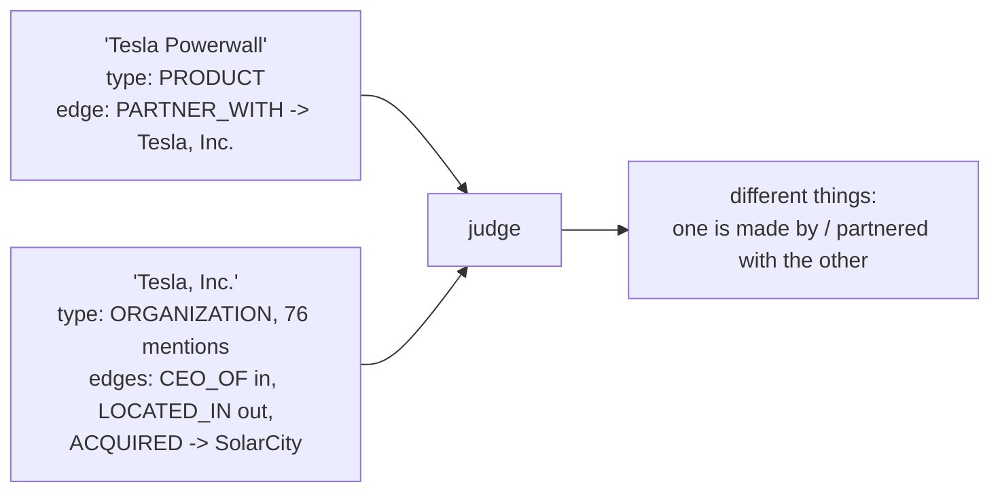

A company *has* a CEO, locations, acquisitions; a product *is manufactured*
by someone. This reasoning fails on strings and succeeds on structure. Every
candidate pair, verdict and refusal is written to `merge_log.json` before the
graph is touched; a bad merge can always be found, and the graph can be
re-merged from the checkpoint in seconds for free.

Three live failures shaped the final design (full story in
[solution.md](solution.md)): a names-only prompt merged everything
Tesla-shaped (fix: graph evidence in the prompt); type guards blocked a
legitimate merge because one inverted edge had typed `tesla motors` as PERSON
(fix: only edges with `mentions >= 2` vote on types); and a names-only batch
merged *Gigafactory Texas* with *Gigafactory Mexico* (fix: explicit
different-locations rule). Final run: 4 small LLM calls, the company variants
and a person merged correctly, all seven products and both gigafactories
correctly refused.

## A.10 — I10 Communities

Some questions name nothing: *"What are the main themes?"* No entity to start
a walk from, and the whole corpus cannot fit in one prompt. Communities
**compress once, at index time**.

Three steps:

1. **Collapse to undirected strength.** All relations between two nodes,
   either direction, become one link with weight `1 + log(total mentions)`.
   The log is not decoration: without it an 80-mention hub outvotes everyone
   and drags the graph into one giant blob (**hub swallowing**); with it a hub
   is loud but not deafening.
2. **Label propagation** — every node starts with its own label; repeatedly,
   each node adopts the neighbour label with the highest weighted vote; stop
   when nothing changes. Inside a dense cluster the label reinforces itself;
   bridges between clusters carry too little weight to merge them. Small,
   dependency-free, reproducible with a fixed visit order.
3. **One LLM summary per cluster** — key members and their relations (with
   cross-community relations marked as borders), returned as a short
   paragraph. Tiny clusters are skipped. Written **once**, read by unlimited
   future questions — the same pay-once-read-forever trick as the checkpoint.

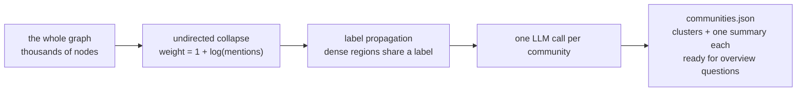

**Ordering rule learned live: merge entities before clustering** — a company
split into three nodes fragments what should be one community. And a
single-topic corpus *correctly* produces one community (low modularity
confirms it rather than hides it).

## A.11 — I11 Embeddings

The graph knows *what connects to what* but is blind to *what means what*;
embeddings are the exact opposite. Index time embeds three inventories:

| What gets embedded | Count | Text that is embedded | Consumed by |
|---|---|---|---|
| **Nodes** | 47 → thousands | *contextualized description*: name + type + mentions + aliases (never the bare `tesla`) | Q2 seed door 2 |
| **Facts** | one per edge | rendered triple `"Elon Musk --CEO_OF--> Tesla, Inc."` | Q4 evidence ranking |
| **Chunks** | ~1,200 | chunk text | Q3 fetch (vector recall) |

Batched, resumable, with backend and dimension checked; never on the critical
path. The relation word in rendered triples is load-bearing — it keeps
Musk-vectors from collapsing into Tesla-vectors.

The theory (full treatment in [embed_research.md](embed_research.md)):
**similarity ≠ relation.** In embedding space Musk ≈ Tesla ≈ Powerwall
(same domain — geometry cannot tell a CEO from a product); in the graph "the
EV maker" does not exist (no string overlap to walk). Each system's blindness
is the other's strength, which is why the query phase is hybrid: **vectors
for recall, graph for structure, LLM for narration.** Embeddings guide the
walk; they never rewrite the map (no `SIMILAR_TO` edges — untyped, symmetric,
hub-prone, and they poison the merge judge's evidence).

## A.12 — Artifact chain and the cost model

Every stage leaves a file, and each file is derived from the one before:

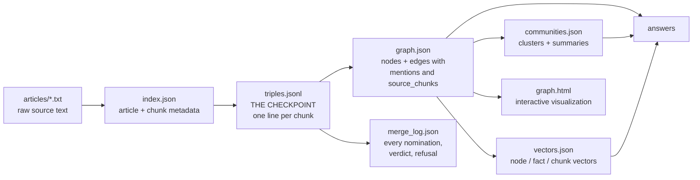

Read the arrows as *"can be rebuilt from"*:

| You delete… | Cost to rebuild |
|---|---|
| `graph.json` | seconds, zero LLM calls |
| `merge_log.json` | a re-merge run; judge calls only, no extraction |
| `communities.json` | seconds + one summary call per cluster |
| `vectors.json` | one embedding batch pass |
| **`triples.jsonl`** | **the entire extraction run again — hours** |

On-disk layout:

```
data/
├── articles/*.txt        raw source text, one file per article
├── index.json            per-article metadata: title, chars, chunk count, preview
├── triples.jsonl         THE CHECKPOINT — one JSON object per chunk (I4)
├── failed_chunks.json    chunk ids that failed permanently; never retried blindly
├── graph.json            nodes + edges, with mentions and source_chunks
├── merge_log.json        every nomination, verdict, refusal (I9)
├── communities.json      clusters + one written summary each (I10)
├── vectors.json          node / fact / chunk vectors + backend metadata (I11)
└── graph.html            interactive visualization
```

**Why plain files, not a database:** at this scale (thousands of facts, a few
hundred KB) JSON is faster to inspect, version and debug — you can open the
graph, the merge log and the summaries in a text editor and see exactly what
the system believes. The two-table shape already matches what a graph store
expects, so the swap is mechanical when scale demands it.

---

# Part B — The query phase (Q0–Q6, QG)

Not every question is the same shape, so the system answers with two
different searches, and choosing between them is itself a cheap decision.
The full flow, in the exact order a question travels:

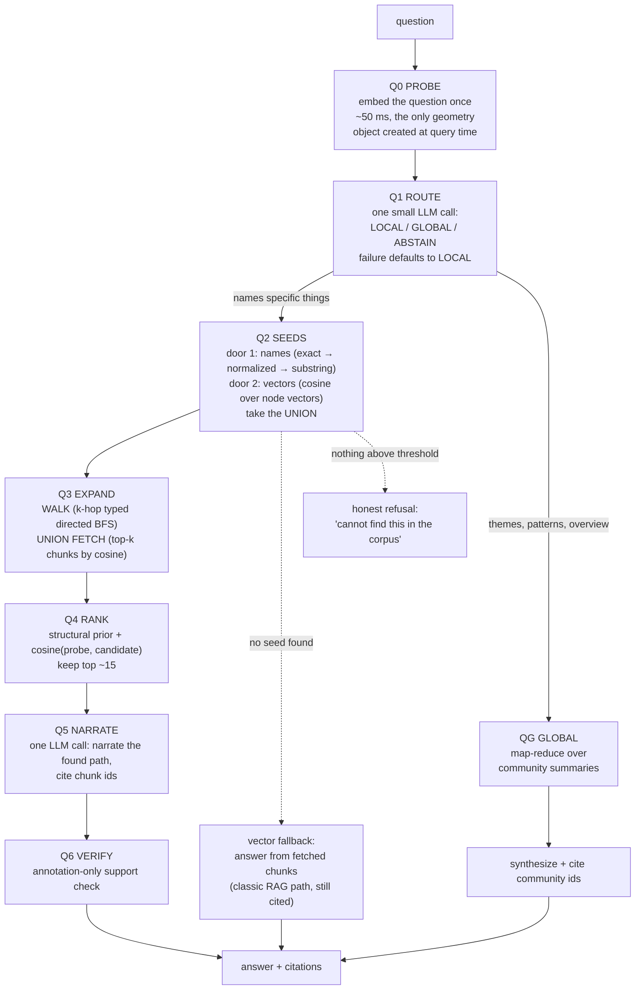

## B.0 — Q0 Probe

Embed the question **once**, before any routing decision. The single vector
— the **probe** — is then reused by three later consumers: seed finding
(door 2), expansion (fetch) and ranking. Embedding inside each stage would
pay three calls and risk inconsistency. The probe is the *only* geometry
object created at query time; everything it is compared against was embedded
once at I11.

## B.1 — Q1 Route / abstain

One small LLM call classifies the question's *shape*:

| Question | Shape | Route |
|---|---|---|
| "Who is the CEO of the EV maker?" | names/implies specific things | **LOCAL** |
| "What are the main themes in this dataset?" | asks about the whole corpus | **GLOBAL** |
| A question the corpus cannot address | out of scope | **ABSTAIN** — a first-class outcome, not an error |

Failure handling: if the router call fails, default to **LOCAL** — the
cheaper, more precise mode. Fail toward the safe option.

## B.2 — Q2 Seeds: two doors, union of results

The question must become **starting nodes**. Two independent doors, take the
**union**:

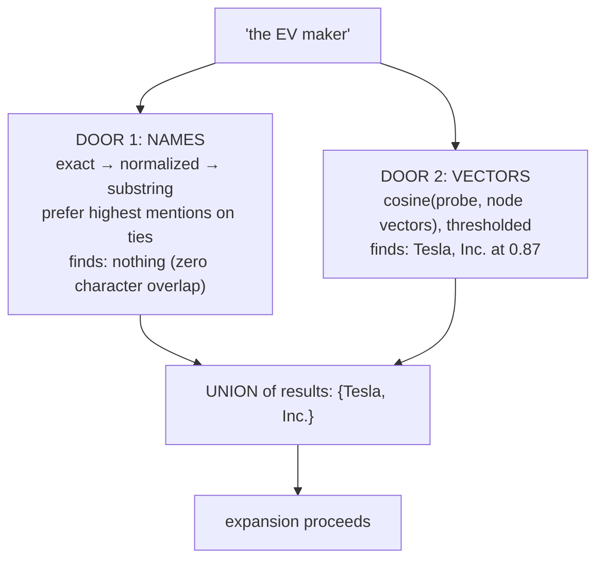

| Scenario | Door 1 | Door 2 | Union result |
|---|---|---|---|
| "Tesla" | exact hit | close | Tesla (agreement = confidence) |
| "the EV maker" | miss | hit | Tesla (vectors rescue) |
| "Musk" | substring hit | hit | Elon Musk |
| made-up name | miss | miss | **empty → fallback path** |

**Doors are for recall; agreement is for confidence.** Door 1 is precise when
it fires but requires character overlap; door 2 covers paraphrase and synonyms
but is promiscuous (vectors cannot say *why* something is close — "Tesla
Powerwall" also scores high). Together they cover each other's blindness, and
linking stops being the single silent point of failure it was under names
alone.

## B.3 — Q3 Expand: `walk ∪ fetch`

The revision over the earlier two-branch design: finding a seed says nothing
about whether the answer needs a *join*, and both retrieval mechanisms are
free — so run **both** and rank the union. Neither costs an LLM call.

**The walk.** From each seed, follow typed, directed edges k hops in both
directions (k = 2 by default). Three properties make it special:

1. **Typed & directed** — the walk knows `CEO_OF` differs from `LOCATED_IN`;
   geometry never had this.
2. **The guarantee** — *if a connection exists within k hops, it is in the
   evidence.* No similarity search can promise that; structure can.
3. **Provenance** — every edge remembers its `source_chunks`; citations
   survive the walk.

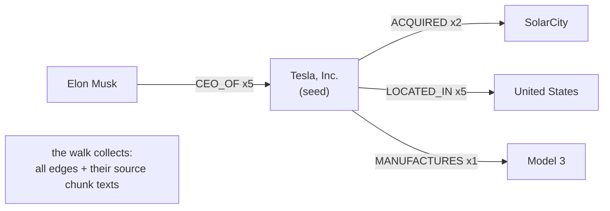

**The fetch.** Independent of the walk: top-k chunks by cosine(probe, chunk
vector). This catches answers that live in a single paragraph the graph never
extracted, or whose path was broken by a missed merge — the cases where a
pure walk returns nothing.

**No-seed path:** if Q2 found nothing, the fetch alone becomes the retrieval
(vanilla RAG living inside the GraphRAG — degraded, no multi-hop, but still
cited). If even the fetch finds nothing above threshold: **honest refusal**.
No path ends in silence.

## B.4 — Q4 Rank

The walk hands back hundreds of facts on a full graph; most are noise for
this question, and a model reading 100 facts may miss the right one buried at
position 47 ("lost in the middle"). Two-stage ranking:

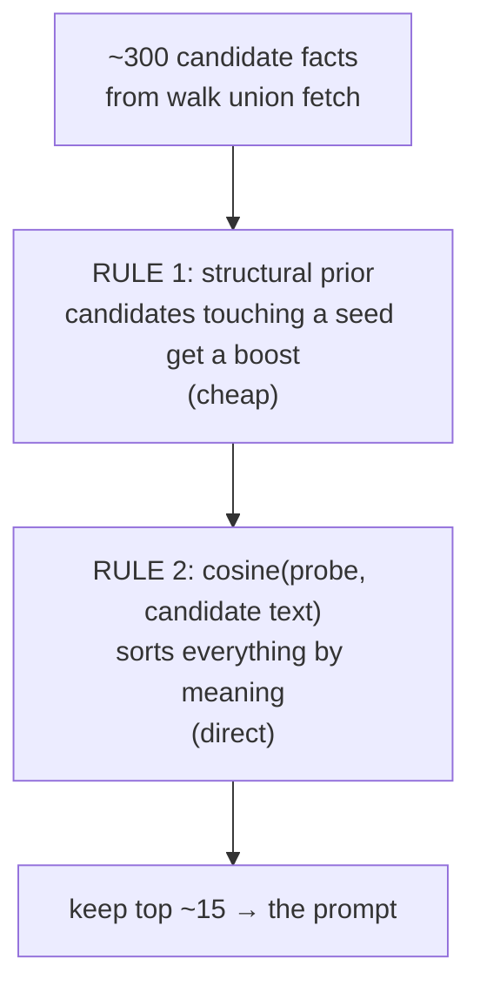

- The structural prior is the *topological* opinion: facts directly about
  what the question named outrank facts two hops out.
- Cosine is the *geometric* opinion: "who is the CEO" pulls `CEO_OF` facts up
  and pushes `LOCATED_IN` down, even though both touch the seed equally.

Division of labour in one line: **the walk decides what exists in the
evidence; embeddings decide what is worth reading.**

## B.5 — Q5 Narrate

One LLM call receives a pre-digested bundle — top-ranked facts + their source
chunks + the question — and must *narrate the connection that was already
found*, citing chunk ids:

```
A: Elon Musk is connected to SolarCity through Tesla's acquisition of
   SolarCity in 2016... [Tesla_Inc::9] [Tesla_Inc::15]
```

Citations are not cosmetic: they let a human verify a claim in seconds and
keep an inverted or stale edge from silently becoming an unverifiable
assertion. The model's job has shrunk from *finding* the connection to
*narrating* it — a smaller job means a smaller model suffices and there is
nothing left to invent.

## B.6 — Q6 Verify (optional)

An annotation-only support check over the drafted answer: per-claim, does the
cited chunk actually say this? In v1 it **blocks nothing** — it marks weakly
supported claims — because a guardrail that wrongly says "supported" is worse
than none until it has been measured on planted unsupported claims.

## B.7 — QG Global search

Questions about everything read the pre-written community summaries via
map-reduce:

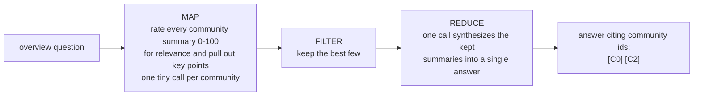

Why this is cheap: the candidate pool is *communities*, not chunks — a
handful of paragraphs pre-compressed at index time — and the map step is
embarrassingly parallel and individually tiny.

## B.8 — The two endings, one contract

| | LOCAL | GLOBAL |
|---|---|---|
| LLM's verb | *narrate* a found path | *synthesize* across summaries |
| evidence | facts + original chunks | community summaries |
| citations | chunk ids (`Tesla_Inc::9`) | community ids (`C0`, `C2`) |
| answers best | "how are X and Y connected?" | "what is this corpus about?" |
| guarantee | structural (k-hop completeness) | coverage (every topic considered) |

Both endings share the same contract: **every claim traceable to something
on disk.**

## B.9 — What the query half guarantees

1. **Fallbacks, not cliffs.** Router fails → default local. Door 1 fails →
   door 2. No seed → fetch instead of walk. Nothing above threshold → honest
   refusal. No path ends in silence.
2. **Free layers narrow, geometry ranks, paid layers decide.** Strings, walks
   and counts are free; embeddings do graded meaning-matching; the LLM decides
   only what genuinely needs judgement. Nothing does another's job.
3. **Index time pays, query time reads.** Query time adds exactly **one**
   embedding call (the probe) and a cosine scan over structures built at I11.

---

# Part C — Failure modes and their defences

Everything that has actually gone wrong, as a table:

| Failure | Why it happens | Defence in the design |
|---|---|---|
| **Fragmentation** — one company becomes three nodes | the reader-model never names anything twice the same way | normalization (I6) + the merge funnel (I9) |
| **Silent traversal death** — paths stop with no error | edges live under a name the walk never visits | merge before clustering/search; two-door seeding; `walk ∪ fetch` |
| **Inverted facts** — a company "acquired" its own investor | models swap head and tail; the result is grammatically valid | shape-checks cannot catch it: mention-count ranking, edge evidence for the judge, citations in every answer |
| **Vague mentions** — "other automakers" as a node | models summarise instead of naming | the vagueness filter at the I5 gate |
| **Compound mentions** — two people in one name | models join lists with "and" | the gate splits them into one fact per part |
| **Hub swallowing** — one giant cluster, no topics | a high-mention hub dominates every vote | community weights use `1 + log(mentions)` |
| **Hallucinated relationships** | models occasionally state absent facts | one-off facts down-rank and prune by mention count; answers cite the source |
| **Cost and interruption** | extraction is one call per chunk, for hours | the I4 checkpoint makes runs resumable; permanently failed chunks are never retried blindly |
| **Wrong merge** | two similar-looking names are different things | asymmetric prompt bias ("a wrong merge is the big error"), maker→made guardrails, code-chosen canonical names, `merge_log.json` audit |
| **No semantic matching** | name-based linking finds nothing for "the EV maker" | fixed by I11 + Q2 door 2 |
| **Lost in the middle** | the right fact buried mid-prompt | Q4 ranks by meaning, keeps top ~15 |
| **Single-topic corpus** | clustering "fails" to find several topics | that *is* the correct answer; modularity confirms it rather than hiding it |

Two meta-lessons run through the table. First: **the model is a component
with a reliability profile, not an oracle** — the architecture wraps it in
rules, counts, evidence and logs. Second: **each layer may be imperfect if
the next layer can detect and contain the damage** — and the final answer can
always be checked by a human.

---

# Part D — Optional overlays (designed, not yet implemented)

## D.1 — Encoder extraction ([NER_model.md](NER_model.md))

Replace the LLM *writer* with a small encoder *labeler* (DeBERTa-class, two
heads: BIO token tagging for entities, pair classification for relations,
trained on silver labels from `triples.jsonl`). An LLM *writes an answer*
(slow, can invent structure); an encoder *highlights the text* (fast, local,
structurally cannot invent an entity or malformed JSON, emits per-label
confidence). The recommended end state is a **hybrid selector**: the encoder
handles ~85% of chunks; low-confidence or rare-relation chunks escalate to
the LLM. The output contract, the gate, merging, communities and querying all
stay unchanged.

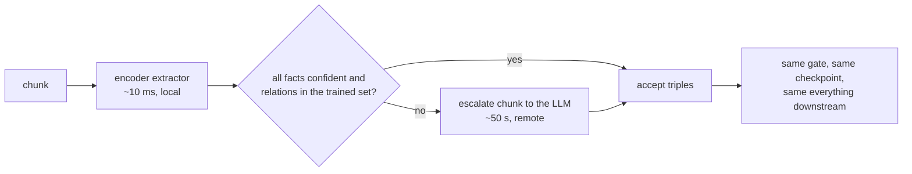

## D.2 — Fast calibrated decisions ([system-1-model.md](system-1-model.md))

Eight proposed insertion points for typed probabilistic decisions at
70–500 ms: entity typing (U1), relation-direction adjudication (U2, fixes the
inversion bug class), merge-pair scoring (U3), chunk triage before extraction
(U4, the big cost cut), retrieval reranking (U5), global-search pruning (U6),
routing with abstention (U7) and an answer guardrail (U8). The pattern is
always the same one the merge funnel already uses — **cheap layers nominate,
expensive layers decide** — with a confidence gap: scores above τ_high are
accepted, below τ_low escalated to the LLM, and the band between is logged,
not acted on. Nothing ships without passing a frozen referee
(`test/real_relation_cases.jsonl` and the audit logs) and a calibration
check.

---

# Part E — Honest limits

- **Extraction noise is contained, not eliminated** — inverted triples and
  some vague mentions survive; the design answers by making them rankable,
  prunable and citable, not by pretending they are gone.
- **Blocking costs recall** — true duplicates sharing no token are never
  compared (the accepted price of affordable candidate search).
- **The graph cannot answer what was never extracted** — Q3's fetch
  mitigates, it does not fix.
- **Embeddings add no knowledge** — they retrieve, they do not reason; the
  merge paradox relocates into vector space rather than vanishing, so the
  LLM judge stays the sole merge authority.
- **Label propagation is a starting point** — chosen for being small and
  dependency-free; modularity-driven and hierarchical methods are the
  natural upgrades.
- **Thresholds** (0.5 nomination, 0.65 seed, 0.30 chunk) and hop caps are
  starting values that need calibration against
  [`test/real_relation_cases.jsonl`](../test/real_relation_cases.jsonl).
- **Over-merging is worse than under-merging** — two fragments of one entity
  cost edge weight; one false merge poisons every future traversal. Every
  threshold and every prompt rule leans toward "do not merge".

---

## The seven rules that hold it together

1. **Model output is a suggestion, not data.** Every stage validates,
   normalizes, caps and logs before it trusts anything.
2. **Cheap layers nominate; expensive layers decide.** Blocking, fuzzy
   scoring and cosine find candidates for free; the model only judges
   candidates. Neither does the other's job.
3. **Give the judge evidence, not just names.** Types, mention counts and
   real edges turn a string-matcher into a decision-maker.
4. **The graph stores structure; the text stays retrievable.** Every edge
   remembers its chunks, so every answer can be cited and checked.
5. **Mention counts are free confidence.** Real relationships are stated
   again and again; noise appears once.
6. **Checkpoint the expensive step.** Extraction is paid once; every
   downstream stage is a free re-derivation from it. When a choice is between
   "do it at index time" and "do it per query" — do it at index time.
7. **Fallbacks, not cliffs.** Every layer is allowed to fail loudly and
   partially; no query path ends in silence.

---

*Deeper dives: [architecture.md](architecture.md) for the theory of every
decision, [graph_making.md](graph_making.md) for build mechanics,
[solution.md](solution.md) for the merge story,
[embed_research.md](embed_research.md) for the geometric layer.*
