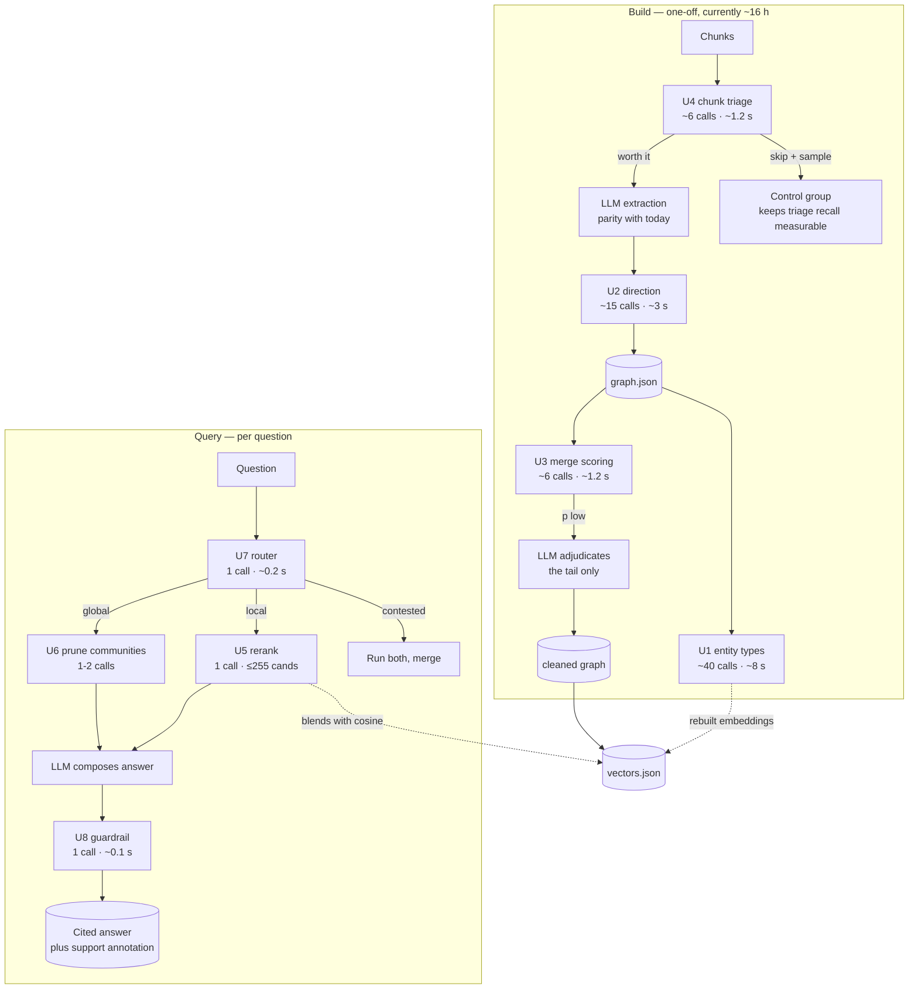

# System One Models & Jev — What They Are, and Where They Fit in This RAG

**Status:** design proposal. Nothing here is implemented. This document
records (a) what a System One Model is, per TypeSafe AI's announcement of
15 Sep 2026, and (b) eight concrete insertion points in this GraphRAG where
one would pay for itself — with the cost arithmetic, the failure modes, and
the referee that decides whether each one actually ships.

> Companion docs: **[architecture.md](architecture.md)** (the whole system),
> **[graph_making.md](graph_making.md)** (build pipeline), **[solution.md](solution.md)**
> (entity merging), **[embed_research.md](embed_research.md)** (the geometric layer).
> Read this one after those; it is an overlay, not a foundation.

---

## 1. What a System One Model is

TypeSafe AI (Diogo Almeida, ex-OpenAI) argues that LLMs were built for chat,
which is the wrong shape for software. Their framing, in one line:

> **unstructured state in, typed probabilistic decisions out** —
> "a frontier-intelligence function call."

A System One Model is not a smaller LLM. It gives up string generation
entirely. You declare the output schema up front; the model returns a value
of exactly that shape, with a calibrated probability on every leaf. From their
own comparison table:

| | Existing LLMs | System One Models |
|---|---|---|
| Training | RLHF / RLVR (human preference, verifiable rewards) | **RLCD** — Reinforcement Learning for Calibrated Decisions |
| Sampling | Sequential, one token conditioned on the last | **Parallel** — all outputs in one query |
| Outputs | Strings: chat, code, hallucinations, refusals | **Type-safe structured values**; type errors impossible |
| Cost | $0.20–$10 / MTok in; output ~5× input | **$0.042 / MTok in; output free** (too cheap to meter) |
| Speed | 3 – 329 s end-to-end | **70 – 500 ms** (they claim 40–200× on System One-shaped queries) |
| Confidence | Overconfident and inconsistent, even when asked | **Calibrated**: higher confidence ⇒ higher accuracy |

Their first public model is **Jev** (named after W. Stanley Jevons: *"every
order of magnitude drop in the cost of intelligence unlocks orders of
magnitude more use cases"*). The class name comes from Kahneman: System 1 is
fast and intuitive, and has historically implied *error-prone* — their claim
is that a model trained for calibrated decisions can be **more** reliable
than its deliberative alternative.

The structural property that matters most to us is the **parallel sampler**.
One call scores *N* candidates at once, not one candidate per call. That
single fact is what makes reranking, not just classification, affordable.

### 1.1 What is a "System One task"?

From their use cases: *smart if-statements* — "classify, route, score, extract,
or branch where hand-written logic is too brittle". Note what that is not. It
is not generation, not open-ended reasoning, not writing a paragraph. It is:

1. **many independent, decomposed sub-decisions**, each small;
2. each producing **fine-grained behaviour dependent on probabilities, not a
   discrete yes/no**;
3. whose **combination** is discrete branching at the end.

> That is precisely the shape of a GraphRAG pipeline. Extraction is N
> independent per-chunk calls. Merge resolution is N independent pairwise
> judgements. Reranking is N independent candidate scorings. Global search is
> literally map-reduce over thousands of community summaries.
>
> The fit is structural, not rhetorical. The parts of this system that are
> *slow and expensive today* are exactly the parts that are *decomposed,
> probabilistic, and branch-y*.

### 1.2 What the vendor does and does not establish

Stated plainly, because the whole document depends on it:

- **Verifiable and taken at face value:** the API is type-safe (a single
  counter-example would falsify it; it is structurally impossible), the
  published prices, and the latency of a given call.
- **Vendor claim, not independently reproduced:** the 193.6× speed and 444.6×
  cost figures on their homepage, and the "off the charts" workflow-eval
  result. Their workflow evals use **the average of GPT-6 Astra and Fable 5.1
  as the reference**, which structurally biases toward OpenAI/Anthropic. The
  workloads were written by their own capabilities team. They state this
  themselves.
- **Unverifiable today:** Jev is *early access*. The announcement links no API
  reference, no schema-definition syntax, and no published benchmark results.
  The FAQ sections "What use cases is Jev good for?" and "Is Jev just a
  smaller LLM?" are rendered without answers on the public page.
- **Constraint we must design around:** **cardinality ≤ 255**. Their Wikiracing
  demo chooses among hundreds of Wikipedia links; beyond 255 they fall back to
  a 2-stage scheme — score independently, then make an explicit choice.
  Several proposals below hit this ceiling and I flag where.

---

## 2. The shape of every proposal

Each of U1–U8 below follows the same template, deliberately:

```
replace:  what heuristic or LLM call it displaces
shape:    the typed decision, in and out
why:      why this is a System One task and not a System Two task
cost:     calls × latency × price, against the current baseline
failure:  the way it goes wrong, and the fallback
gate:     the confidence threshold and who handles the tail
```

The confidence gate is the load-bearing idea, and it is the same one that
already runs through `merge_entities.py`: **cheap layers nominate, expensive
layers decide**. Jev does not replace that principle; it moves the cheap layer
from "fuzzy string arithmetic" to "calibrated probability", which means the
LLM now only ever sees the genuinely ambiguous tail — a fraction of the work,
and a fraction that is *selected* rather than *filtered*.

```
                    ┌──────────────────────────────────────┐
   candidates ──────▶  System One: calibrated P(decide)     │
   (cheap filter)     per candidate, all in ONE call        │
                    └───────────────┬──────────────────────┘
                                    │
              p ≥ τ_high ──────────┼────────── p < τ_low
                    │                               │
                    ▼                               ▼
            accept, no LLM              escalate to the LLM
            (majority of volume)        (the ambiguous tail only)
```

The **gap between τ_low and τ_high** is deliberate. Inside it, the System One
score is logged but not acted on — those are the cases where we want to
*measure* the model, not trust it.

---

## 3. The eight proposals

### U1 — Entity type classification (validation gate)

**Replaces.** The hand-written regex gate in `graph.py` — `_VAGUE_RE`, which
rejects strings beginning *other, various, many, companies, government, …* —
plus the `backfill_types()` voting heuristic that guesses a type from edge
relations.

**Shape.** In: an entity mention plus its chunk sentence. Out: a distribution
over the six `graph.VALID_TYPES`.

```jsonc
{
  "type": {"PERSON": 0.91, "ORGANIZATION": 0.08, "LOCATION": 0.01},
  "is_vague":     {"true": 0.03, "false": 0.97},
  "is_compound":  {"true": 0.02, "false": 0.98}   // "A and B" jammed together
}
```

**Why.** Type is the single most load-bearing signal downstream: `solution.md`
documents that a wrong type caused a *real* merge failure — "Tesla Motors"
being typed `PERSON` blocked a legitimate merge. It is one independent
classification per mention, thousands of times, where today's answer is a
regex plus a popularity vote.

**Cost.** ~1,200 chunks / ~4,000 mentions. Batched at 100 mentions per call
(under the 255 ceiling): **~40 calls × 0.2 s ≈ 8 s**, ≈ 0.4 M input tokens ≈
**$0.017**. Replaces zero LLM calls today, and gates ~1,200 that happen later.

**Failure.** Confidently wrong on domain jargon — a model name or an acronym
reads as `ORGANIZATION`. Fallback: keep today's `backfill_types()` vote as the
floor and take Jev only where it is confident *and* disagrees with the vote.
Disagreements become a labelled disagreement set, which is free evaluation data.

**Gate.** `τ_high = 0.85` accept · `τ_low = 0.60` escalate to LLM · between:
log the disagreement, trust the vote.

---

### U2 — Relation direction adjudication

**Replaces.** Nothing — this *fixes a known bug class*. The README and
`graph.py` both record that small models emit inverted triples
(`SUBSIDIARY_OF → Elon Musk` instead of `Tesla → SUBSIDIARY_OF → Musk`), and
`config.py` has a hardcoded comment excluding `FOUNDED_BY` / `ACQUIRED_BY`
from type backfill *specifically because* of this bug. Today we blunt it with
a comment and a whitelist. That is a workaround standing in for a decision
procedure.

**Shape.** In: `(head, relation, tail)` plus the sentence it came from. Out:
the direction, with confidence.

```jsonc
{"direction": {"head_to_tail": 0.94, "tail_to_head": 0.06},
 "too_vague": {"true": 0.11, "false": 0.89}}
```

**Why.** Exactly one small, independent, high-cardinality, probabilistic
decision per extracted triple — the canonical System One shape.

**Cost.** One call per triple, batched 200 triples/call (at ~250 tokens each,
under 255 cardinality). For the ~3,000 triples in a 1,200-chunk run:
**~15 calls ≈ 3 s**, ≈ 0.75 M tokens ≈ **$0.032**.

**Failure.** Silent inversion on relations with no lexical anchor — if the
sentence says "A was founded by B", direction is easy; if it says only
"B founded A in the panel discussion", it is genuinely ambiguous and the model
should *say so* via a low probability. The `too_vague` field is what keeps a
confident answer from being manufactured.

**Gate.** `p ≥ 0.80` keep inverted · `p < 0.55` keep as extracted · between:
drop the triple (a dropped bad edge is cheaper than a wrong one).

---

### U3 — Merge-pair scoring inside the merge funnel

**Replaces.** The hard-coded `NOMINATE_THRESHOLD = 0.5` in
`merge_entities.py`, which currently cuts a `0.6·Jaro-Winkler +
0.4·token-overlap` score with a constant tuned by hand.

**Shape.** In: a nomination cluster from the existing blocking step — name,
type, mention count, and the graph edges `entity_context()` already builds —
plus its top competing partitions. Out: the grouping.

```jsonc
{"groups": [{"members": ["Tesla, Inc.", "Tesla", "Tesla Motors, Inc."],
             "p_correct": 0.88}],
 "merge_count": {"2": 0.10, "3": 0.85, "4": 0.05}}
```

**Why.** The funnel already produces exactly the right input — the expensive
part (blocking + fuzzy) is free, and the decision is LLM-only today. This
replaces *every* LLM call in this stage with one scored call, falling back to
the LLM only below threshold.

**Cost.** This is the headline saving. Clustering is capped at
`MAX_BATCH = 15` per LLM call today, and a full run makes one call per
cluster — call it ~120 calls × 50 s ≈ **100 minutes**, and it is the *only*
LLM cost in the merge stage. With Jev: ~6 calls, **~1.2 s**.

**Failure.** The prompt in `merge_entities.py` encodes three hard-won rules
(brand-word collisions, maker-vs-made edges, location disambiguation) that
were each added after a live failure. A schema-only model gets no rules unless
we put them in the state — so the input must include the cluster's edges and
the existing product-edge guard, exactly as `entity_context()` renders them
today. This is the highest-risk proposal for that reason.

**Gate.** `p_correct ≥ 0.85` merge · `< 0.60` send to the LLM · between: merge
**and** log for the audit trail, because that band is where the interesting
failures live.

---

### U4 — Chunk triage before extraction

**Replaces.** Nothing — this **removes most of the 16-hour cost** recorded in
the README's limitations. `build_graph.py` spends one LLM call per chunk on
all ~1,200 chunks, ~50 s each on a small local model, and then discards a
great deal of what comes back (vague entities, inverted triples, junk).

**Shape.** In: raw chunk text, never seen by an LLM. Out: expected extraction
yield, and the dominant entity types present.

```jsonc
{"extraction_yield": {"rich": 0.71, "sparse": 0.22, "empty": 0.07},
 "entity_types":    {"ORGANIZATION": 0.8, "PERSON": 0.4},
 "worth_llm_call":  {"true": 0.66, "false": 0.34}}
```

**Why.** Pure scoring over unstructured input with a structured verdict. The
cardinality is 1 (one verdict per chunk), so the 255 ceiling is irrelevant.

**Cost.** **~6 calls × 0.2 s ≈ 1.2 s** for all 1,200 chunks, ≈ 0.4 M tokens
≈ **$0.017** — against a baseline of ~16 hours. Even at a pessimistic 50%
false-positive rate on `worth_llm_call`, the LLM bill halves.

**Failure.** This is the proposal most likely to be wrong in an interesting
way: a chunk scoring `empty` might be a footnote that happens to be dense.
That is not a bug to hide — a cheap classifier that is wrong in a *measurable*
way is precisely the kind of thing this project's evaluation ladder exists to
characterise. Fallback: always extract the top-N% by yield, plus a random
sample of the bottom, so the triage's own recall stays measurable.

**Gate.** Not a gate but a budget policy: extract everything above
`p(worth_llm_call) ≥ 0.5`, plus the bottom decile as a control group.

---

### U5 — Retrieval evidence reranking (the embed layer's missing half)

**Replaces.** `embed.py`'s pure-cosine ranking, which `embed_research.md`
itself flags as the weak point: cosine measures topical similarity, not
answer-bearingness.

**Shape.** In: one question, the candidate facts and chunks retrieved so far
(**cardinality ≤ 255 — exactly the published ceiling, and no more**). Out: a
score per candidate.

```jsonc
{"scores": [{"id": "Tesla_Inc::9", "p_answers": 0.81},
            {"id": "Nvidia::42", "p_answers": 0.12}]}
```

**Why.** Reranking is the textbook high-cardinality choice problem, and the
parallel sampler is what makes it affordable: **one** call scores 200
candidates, where a sequential model needs 200 calls.

**Cost.** **1 call ≈ 0.2–0.5 s per query**, ≈ 4 k tokens ≈ **$0.0002**.
Per-query cost is effectively free; this is the use case the "every order of
magnitude" claim is about.

**Failure.** Above 255 candidates the schema forces the 2-stage fallback —
score independently, then choose. Our local search can exceed 255 candidates
on a 3-hop walk from a hub like Elon Musk. Design for the split: partition by
community, score each partition in one call, then a final call to choose.

**Gate.** Blend rather than replace: final score = `α·cosine + β·p_answers`,
α tuned on the DocRED fixture. Keeping cosine in the mix means a bad Jev
ranking degrades to today's behaviour rather than to nonsense.

---

### U6 — Global-search map-reduce pruning

**Replaces.** `query_graph.py`'s global search, which currently map-reduces
**every** community summary for **every** question. On a large corpus that is
the dominant query-time cost and most of it is irrelevant to the question.

**Shape.** In: the question plus all community summaries. Out: which
communities could possibly contribute, and in what order.

```jsonc
{"relevant": [{"community": 7, "p": 0.79}, {"community": 3, "p": 0.71},
              {"community": 12, "p": 0.08}]}
```

**Why.** This is map-reduce with a learned, calibrated map stage — they name
map-reducing over big data as a headline use case. Cardinality = number of
communities; above 255, partition by super-cluster first.

**Cost.** Reduces the map stage from *N communities × 1 LLM call each* to
**1–2 calls**. If today a question costs ~40 community summaries at ~50 s, this
is the difference between a 30-minute answer and a sub-second one.

**Failure.** Confidence calibration is what makes pruning safe: at high N the
model must not return a confident shortlist that quietly drops the one
community that mattered. Mitigation: keep the top-k *plus* every community
whose score is within one standard error of τ.

**Gate.** Prune below `p = 0.15`; keep everything above.

---

### U7 — Query routing with an honest abstention

**Replaces.** `query_graph.py`'s router — the hard-coded choice between local
search (link entities → k-hop walk) and global search (map-reduce). It is
exactly the "hand-written logic that is brittle for certain question shapes"
case: a question with **no** entity in the graph should not launch a local
walk, and today we find that out by watching it return nothing.

**Shape.**

```jsonc
{"intent":   {"local": 0.62, "global": 0.30, "out_of_scope": 0.08},
 "entities": [{"name": "Elon Musk", "p_in_graph": 0.97}]}
```

**Why.** Classification plus calibration, the purest System One task there
is. The novel part is `p_in_graph`: a question about an entity the corpus
never mentions should route to `out_of_scope` **and say so**, rather than
producing a confident answer assembled from whatever was nearest.

**Cost.** 1 call, ~0.1–0.2 s, sub-cent. Invisible against any baseline.

**Failure.** Router error is worse than no router: a global/local mix-up
returns a confidently wrong *kind* of answer. Fallback: when `p(max
intent) < 0.6`, run **both** searches and merge — the expensive path is still
cheap for one query.

**Gate.** Route only above `τ = 0.6`. Below it, run both. This is the
escalation-packet handoff in miniature: Jev routes and pre-computes, the LLM
reasons only when the decision is genuinely contested.

---

### U8 — Answer guardrail (verify everything)

**Replaces.** Nothing. This is new coverage: today **no stage checks the
generated answer against its own citations**. `graph.py` guarantees each
*edge* carries `source_chunks`, and then nothing verifies the final prose
actually says what those chunks say.

**Shape.** In: the drafted answer, its cited chunk ids, and the chunk text.
Out: per-claim support.

```jsonc
{"claims": [{"text": "Tesla acquired SolarCity in 2016.",
              "supported": {"yes": 0.94, "no": 0.06},
              "cites": "Tesla_Inc::9"}],
 "any_unsupported": {"true": 0.04, "false": 0.96}}
```

**Why.** Judging and guardrailing generated output is named explicitly as a
use case ("score, judge, verify, guardrail, and detect jailbreaks of LLM
prompts, reasoning traces, and/or outputs"). Crucially, *the input here is
structured state* — a claim list and chunk ids — which is their strong suit
rather than their weak one.

**Cost.** 1 call, ~70–200 ms, ≈ $0.001. Cheap enough to run on **every**
answer.

**Failure.** A guardrail that says "yes" is worse than none, because it is
trusted. It must be evaluated for **false-negative rate on planted
unsupported claims** before it is allowed to block anything. Until then its
only power is to *annotate* ("this claim is weakly supported") and never to
suppress.

**Gate.** Block nothing in v1. Annotate only. Promotion to blocking requires
the referee in §5.

---

## 4. The combined architecture



Two figures summarise the shape of the change: **the build side gains a fixed
~29 calls total (U1+U2+U4) for about six cents**, and the **query side costs
3–4 calls and well under a cent per question** while cutting the global-search
map stage from one call per community to one or two.

Per query, the added cost is **≈ 3–4 calls, ~1 s, < $0.01**. The saving is
on the build side and in the global-search map stage.

---

## 5. The referee: how we decide whether any of this ships

The rule this project already follows — from `solution.md` — is that a
promotion happens only when it beats the incumbent on real data. Three of the
proposals (U2, U3, U6) can be measured against ground truth we already have,
and `test/real_relation_cases.jsonl` (**500 human-annotated DocRED cases**, with
relation direction, evidence token offsets, and a `property_name`) is exactly
the right fixture — it was built for precisely this kind of referee.

**The ladder.** Each proposal must clear one rung before it is allowed to
influence an answer:

| Proposal | Incumbent | Referee | Gate to promote |
|---|---|---|---|
| U1 types | regex + vote | hand-labelled 300 mentions | ≥ incumbent F1, and 0 new real-merge regressions |
| U2 direction | drop-the-inverted-types | 500 DocRED cases (direction is explicit) | ≥ incumbent, measured on direction only |
| U3 merges | fuzzy 0.5 + LLM | the merge audit log `data/merge_log.json` | fewer false merges at equal-or-better coverage |
| U4 triage | extract everything | control-group yield | ≥ 95% of extracted triples retained |
| U5 rerank | cosine | DocRED retrieval hit-rate | ≥ cosine at equal k |
| U6 prune | all communities | answer agreement with unpruned | ≥ 99% identical answers, ≥ 50% fewer calls |
| U7 router | hard-coded | labelled question set | ≥ incumbent routing accuracy |
| U8 guardrail | nothing | planted unsupported claims | measured; annotate-only until proven |

Two rules make this a referee rather than a demo:

1. **The harness is frozen.** As TypeSafe notes for their own evals, if the
   harness can change alongside the model you are measuring harness
   engineering. Every rung above uses a fixture that predates the proposal.
2. **Every decision is logged with its probability**, including the ones
   inside the τ_low–τ_high gap where we did nothing. That log is the only
   thing that makes calibration *measurable* rather than asserted, and it is
   free — we are paying for the score either way.

### 5.1 The calibration check, which is not optional

Every rung above is a threshold `τ`, and a threshold is meaningless unless
higher probability actually means higher accuracy. So before any τ is used:

- bin every logged decision by probability bucket;
- plot realised accuracy per bucket;
- **require monotonicity** — if bucket 0.9–1.0 is not at least as accurate as
  0.7–0.8, the model is not calibrated for *this* task and the whole design
  collapses to "a fast classifier with confident noise".

This is the single most important experiment in this document, and it is
cheap: it runs on the log from U1 and U2 within a day of an API key.

---

## 6. Honest limits

**About the technology.**
- **Early access.** No published API reference, no schema syntax, no public
  benchmarks on the announcement page. Every number in §1 is a vendor claim.
- **The eval is structurally biased.** Their reference is the average of the
  two largest proprietary models, so "beats the reference" partly means
  "disagrees with OpenAI and Anthropic". Their workloads were written in-house.
  Treat the Pareto-frontend chart as marketing until reproduced.
- **Pricing is unproven by the vendor's own admission.** They cannot rule out
  subsidisation. The *relative* arithmetic in §3 only holds while input is
  $0.042/MTok and output is free; if output ever gets metered, U5 and U6 —
  which emit large outputs — degrade first.
- **Cardinality 255 is a hard architectural edge.** U5 and U6 both cross it on
  real queries from a hub node. The 2-stage fallback is described, not
  benchmarked.
- **Type-safety is not truthfulness.** Jev cannot emit a value outside the
  schema. It can still be confidently wrong *inside* it — a well-typed
  `p_answers: 0.94` that is simply incorrect. Type safety kills the parse
  failure and the malformed-call failure; it does not touch the semantic one.
- **It generates no text.** Every proposal above is a decision. The final
  answer, the community summaries, and the extraction JSON still need a System
  Two model. This reduces System Two's *surface area*; it does not replace it.

**About these proposals.**
- **U3 is the riskiest.** It replaces a prompt that encodes three rules each
  paid for by a live failure. If the schema-only input cannot carry those
  rules, merge quality drops where it currently works. Sequence it last, after
  U1/U2/U4 have produced the disagreement logs that would reveal the problem.
- **U4 trades recall for money, and the recall is not yet measured.** The
  control group in §3/U4 is not optional bookkeeping — it is the only way to
  know the triage is not silently dropping facts.
- **U8 could make the system worse** if it is trusted before it is measured.
  Annotate-only is the correct v1.
- **None of this is implemented.** No file in this repository has been changed
  by this document. The `graphs.json` pipeline described above is a proposal
  against a pipeline that is itself currently being rebuilt from scratch.

**The uncomfortable one.** Eight proposals that each need an API key, a frozen
harness, and a calibration study is a lot of machinery. If the goal is a
*general-purpose* RAG rather than a demonstration of a new model class, U4 and
U6 alone — the two that cut real cost — are most of the value at a fraction of
the surface area. The rest is worth having only if the calibration log says the
probabilities mean something.

---

## 7. Source

Diogo Almeida, *Introducing System One Models & Jev*, TypeSafe AI blog,
15 Sep 2026 — <https://typesafe.ai/blog/introducing-system-one-models-and-jev>
(company announcement; all performance and pricing figures in §1 are the
vendor's, and this project has not independently reproduced any of them).